# MLB Trade Deadline Impact Model: An Interrupted Time Series Framework
**Developed by:** Micah Bentley (https://github.com/MLBentley-Data) & Jack Behnfeldt (https://github.com/jbehn-stonecold)  
**Seasons covered:** 2025 and 2026 · **Last updated:** September 2026

---

## Executive Summary
This framework measures the "excess returns" of the MLB trade deadline. At each deadline we freeze every team's profile and use **CatBoost** models to project its rest-of-season results as if it had stayed unchanged. Once the season ends, we compare that counterfactual to what actually happened.

We've now run it on two deadlines with the same method:

- **2025 (Jul 31):** projections missed by an average of **3.3 wins** per team over the second half. 26 of 30 teams finished inside the 90% interval.
- **2026 (Aug 3):** the average miss fell to **3.0 wins**, and 28 of 30 teams finished inside the 90% interval. The published Aug 3 standings called **11 of 12 playoff teams**.

---

## 📊 How It Works
To prevent target leakage, every team's profile is frozen at the deadline. The pipeline engineers **128 features** per game:

* **WLS trend slopes:** weighted least-squares trends that weight recent games more heavily, capturing a team's momentum entering the deadline.
* **Split pitching metrics:** starter ERA and bullpen ERA separately, plus how the innings are split between them.
* **Scoring volatility:** the coefficient of variation of run differential (`cv_run_diff`), measuring consistency independent of raw scoring.
* **Opponent mirroring:** the full feature set is mirrored for each opponent, so strength of schedule is built into every game.

Three models (runs scored, runs allowed and win/loss) are tuned with a grid search and SHAP-based feature selection. Every model is compared against a Pythagorean-expectation baseline.

---

## 📈 Year-over-Year Scorecard

| | **2025** | **2026** |
|---|---|---|
| Trade deadline | Jul 31, 2025 | Aug 3, 2026 |
| Held-out validation season | 2024 (1,596 games) | 2025 (1,590 games) |
| Validation W/L accuracy: model vs baseline | **57.96%** vs 54.70% (McNemar p = 0.007) | **55.91%** vs 53.77% (McNemar p = 0.07) |
| Second-half games scored | 795 | 739 |
| Average miss, second-half wins | 3.27 | **3.00** |
| Teams inside the 90% interval | 26 / 30 | **28 / 30** |
| Second-half W/L accuracy | 55.9% | **57.2%** |
| Runs scored / allowed error per game (RMSE) | 3.20 / 3.19 | **3.09 / 3.09** |
| Top overperformer | ATL (+6 wins) | SDP (+8 wins) |
| Top underperformer | NYM (−8 wins) | COL (−7 wins) |

In both validation seasons the runs-scored model significantly beat the baseline: p = 0.018 on 2024 and p = 0.0001 on 2025. The runs-allowed model did so on 2024 (p = 0.002) but not on 2025 (p = 0.16).

---

## 🧪 Model Validation: Held-Out Seasons

Each year's model is tested on a full season it never saw before being used at the deadline.

<p align="center">
  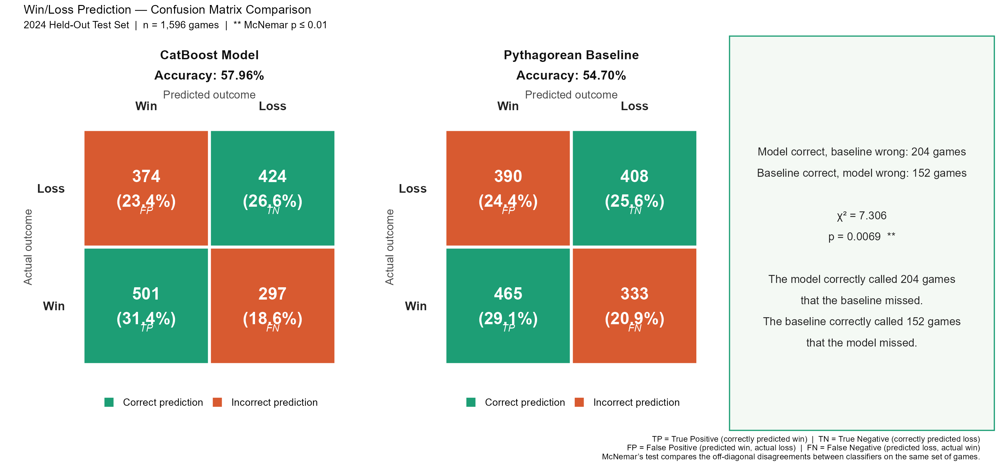
  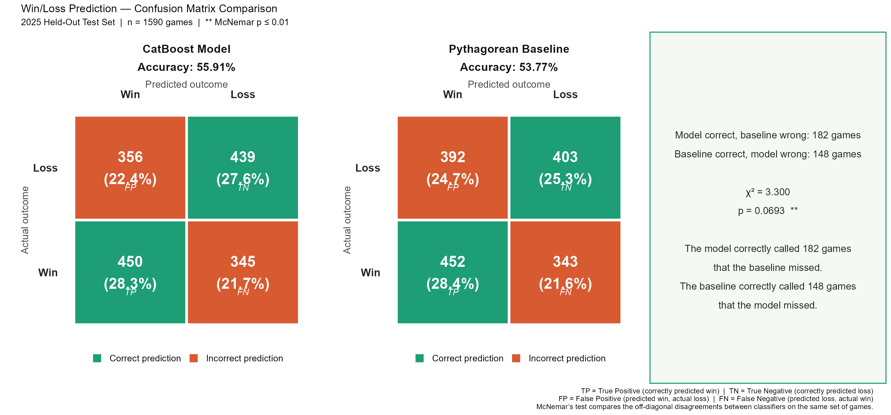
</p>
<p align="center"><em>Figure 1: Win/loss confusion matrices vs. the Pythagorean baseline. Left: the 2025 model on 2024. Right: the 2026 model on 2025.</em></p>

---

## 🚀 Deadline Impact: 2025 vs 2026

Every team's second half against its deadline projection, in wins, runs scored per game and runs allowed per game.

<p align="center">
  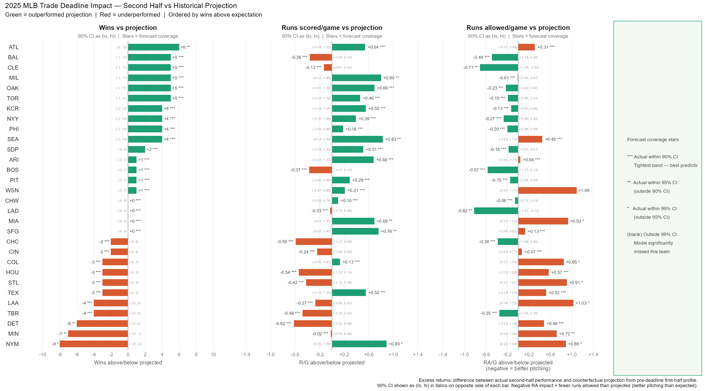
</p>
<p align="center">
  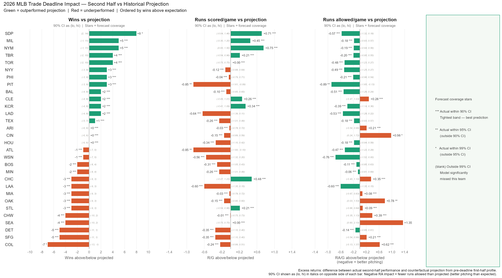
</p>
<p align="center"><em>Figure 2: League-wide deadline excess returns. Top: 2025. Bottom: 2026.</em></p>

How far off was each team's win projection?

<p align="center">
  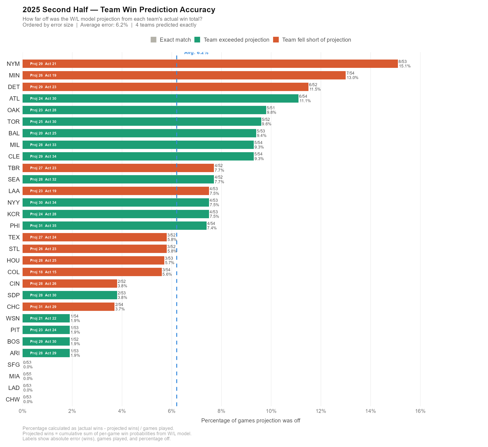
  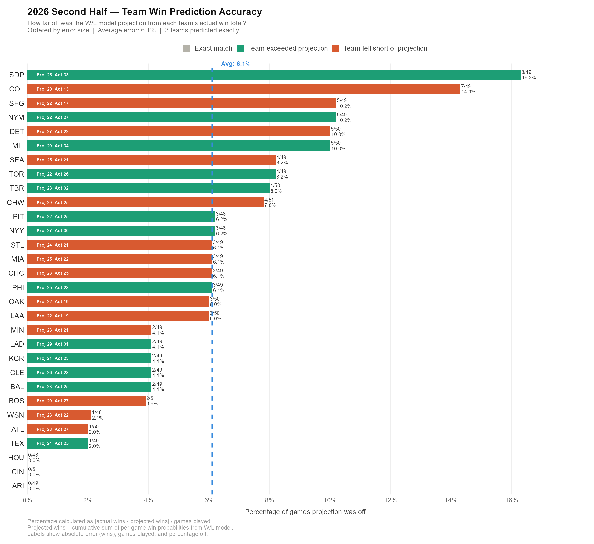
</p>
<p align="center"><em>Figure 3: Win-projection error as a share of games played. Left: 2025. Right: 2026.</em></p>

---

## ⚾ Biggest Over- and Underperformers

<table>
  <tr>
    <th width="50%">2025</th>
    <th width="50%">2026</th>
  </tr>
  <tr>
    <td>
      <b>🔼 Atlanta Braves: +6 wins</b><br/>
      46-62 at the deadline · projected 70 wins · finished <b>76-86</b><br/>
      The offense took off (+0.54 runs/game over projection) even though the pitching allowed +0.31 runs/game more than projected. Deadline moves were small: Dane Dunning, Tyler Kinley and Jim Jarvis.
    </td>
    <td>
      <b>🔼 San Diego Padres: +8 wins</b><br/>
      58-55 at the deadline · projected 83 wins · finished <b>91-71</b><br/>
      Better on both sides of the ball: +0.71 runs scored and −0.57 runs allowed per game. They bought pitching: Casey Mize, Robbie Ray and Hunter Stratton. The Aug 3 projection had them missing the playoffs; they won a wild card.
    </td>
  </tr>
  <tr>
    <td>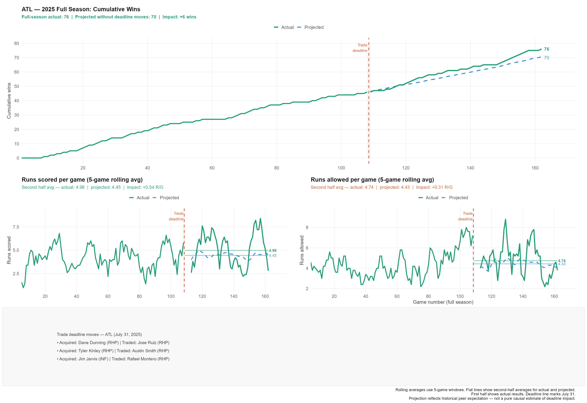</td>
    <td>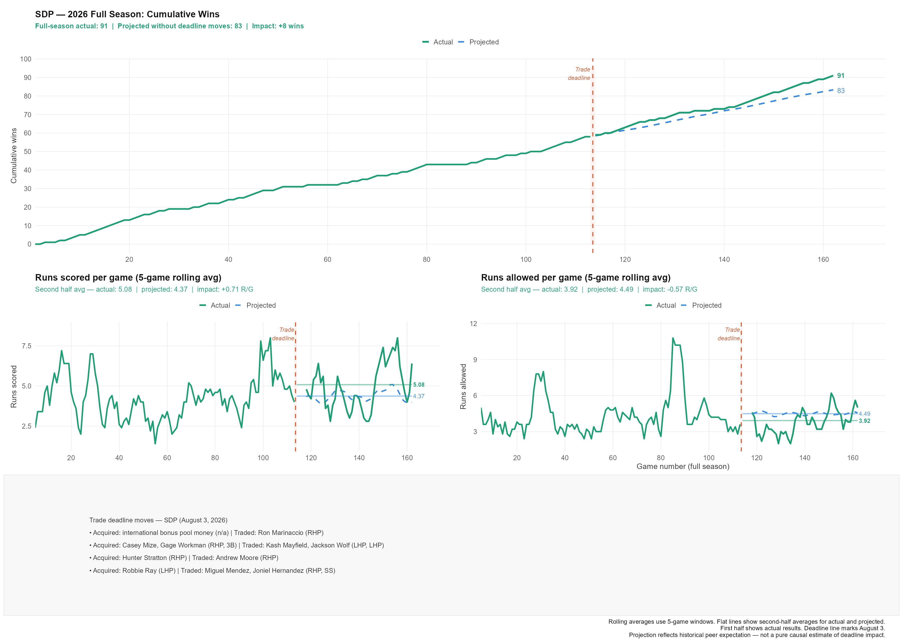</td>
  </tr>
  <tr>
    <td>
      <b>🔽 New York Mets: −8 wins</b><br/>
      62-47 at the deadline · projected 91 wins · finished <b>83-79</b><br/>
      The Mets bought Ryan Helsley, Tyler Rogers and Cedric Mullins, and the bats responded (+0.89 runs/game). But the pitching gave all of it back (+0.89 runs/game allowed), and they fell 8 wins short of their pre-deadline pace.
    </td>
    <td>
      <b>🔽 Colorado Rockies: −7 wins</b><br/>
      45-68 at the deadline · projected 65 wins · finished <b>58-104</b><br/>
      A seller that got worse. They traded away Brenton Doyle, Seth Halvorsen, Victor Vodnik and Antonio Senzatela. The staff allowed +0.62 runs/game more than projected and the offense slipped −0.24.
    </td>
  </tr>
  <tr>
    <td>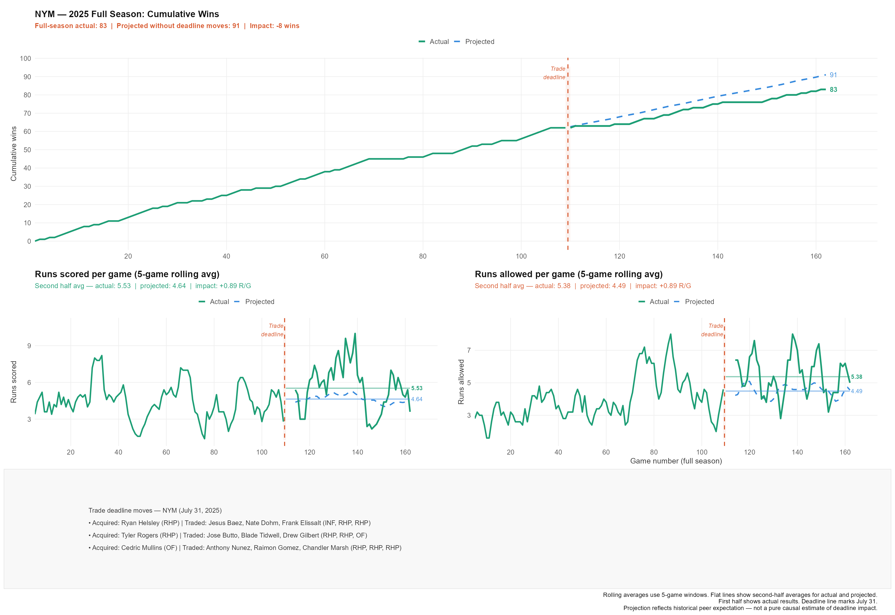</td>
    <td>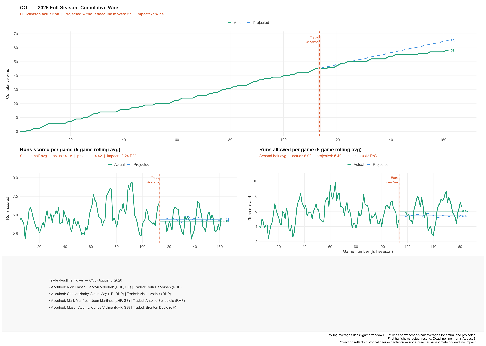</td>
  </tr>
</table>

<p align="center"><em>Figure 4: Full-season cumulative wins, with the actual second half against the deadline projection. Each panel lists the team's deadline trades.</em></p>

---

## 🏆 2026: Published Deadline Standings vs Final Standings

In 2026 we also published full-season standings on Aug 3. Scored against the final standings, they called **11 of 12 playoff teams** and **5 of 6 division winners**, with an average miss of **2.8 wins**.

<p align="center">
  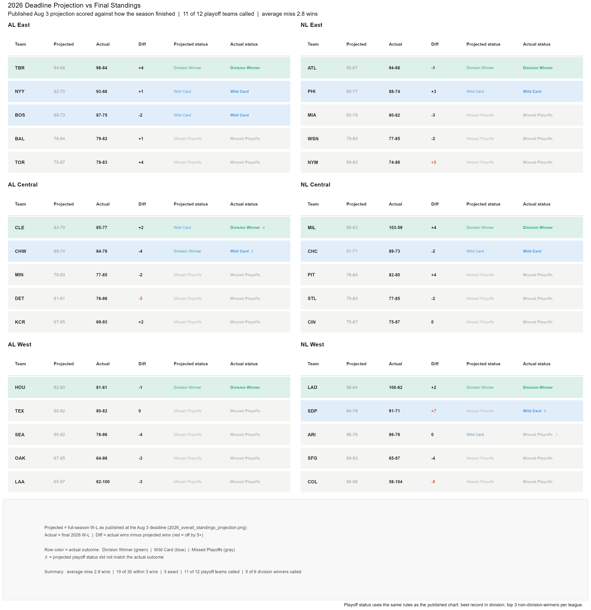
</p>
<p align="center"><em>Figure 5: The Aug 3, 2026 projection next to each team's final record and playoff outcome.</em></p>

---

## ⚠️ Limitations
* **Counterfactual, not causal.** The projection shows how a team's pre-deadline profile would be expected to play out. The gap between that and the actual result includes trades, but also injuries, luck and regression.
* **Home field isn't modeled yet.** `is_home` was always 0 in the feature data, so neither year's model learned a home-field effect. This will be fixed before the next retrain.
* **2026 deadline-day games.** The 8 games played on Aug 3, 2026 were missing from the deadline run; placeholder games stood in for them. This moves a published full-season record by at most one win. See [`2026/README.md`](2026/README.md).

---

## 🛠️ Repository & Reproduction

| Folder | What's inside |
|---|---|
| [`2025/`](2025/) | The original ECON 3060 project: pipeline, results, visuals and class presentation |
| [`2026/`](2026/) | The rebuilt pipeline, 2026 deadline projections, and end-of-season validation |
| [`readme-visuals/`](readme-visuals/) | The four panels in Figure 4 and the script that renders them |

Each season's scripts are numbered to run in order from that season's `scripts/` folder. See each season's README for details.

> ⚠️ **Data dependency notice:** to respect the data provider's Terms of Service, this repository does **not** host raw Stathead tables. A personal Stathead subscription is required to pull the game logs into each season's `data/` folder. Copy `.env.example` to `.env`, add your credentials, and load it with `readRenviron(".env")` before scraping.

### R Package Prerequisites
The `catboost` package isn't on CRAN and must be installed from GitHub:
```R
# 1. Install developer tools
if (!requireNamespace("devtools", quietly = TRUE)) install.packages("devtools")

# 2. Install the CatBoost R package
devtools::install_github("catboost/catboost", subdir = "catboost/R-package")

# 3. Required pipeline libraries
library(dplyr)
library(catboost)
library(ggplot2)
library(patchwork)
```
